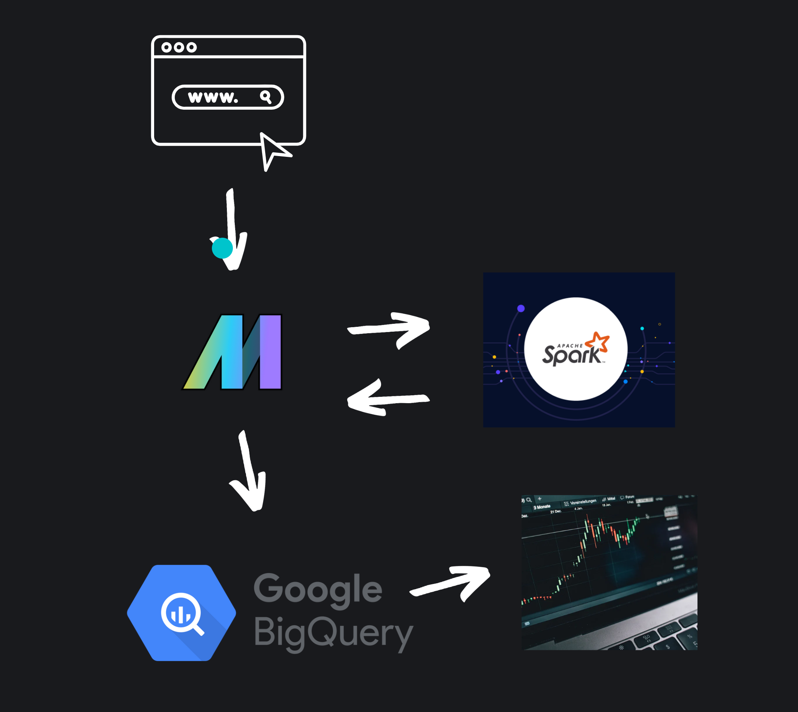
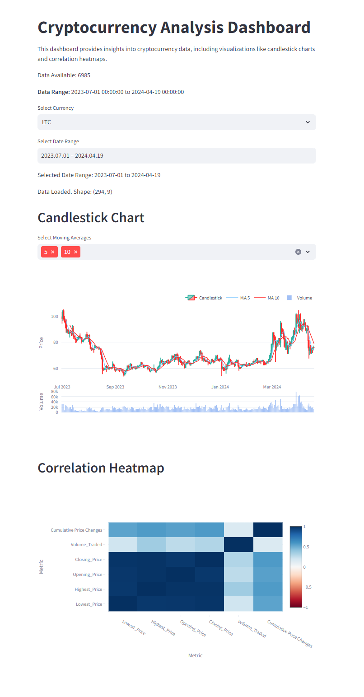

# CryptoSentiment Dashboard and Pipeline

## Introduction

This repository houses the CryptoSentiment Dashboard and Pipeline, a comprehensive tool developed during the Data Engineering Zoomcamp. The dashboard aims to provide insightful analyses and future predictions of cryptocurrency trends for personal trading endeavors.

## Problem Statement

The primary objective of this project is to create a reliable dashboard that offers both an overview and predictive insights into cryptocurrency markets. This tool is designed to assist with informed decision-making in personal cryptocurrency trading activities.


## Disclamer:

Apparently due to time issues there are still some bugs or small errors in the Code, i will try to remove them asap. The project was originally designed to run fully in the cloud but the time frame forced me to this half half solution. Please review politely xD 

It could be that the runpipe scripts might trigger the pipline, however it failes. It seems to be an internal error from mage. In this case please run for init the coinbase-histo pipline and for updating the existing data the orchestration pipline manually.

## Technology Stack

The project leverages several cutting-edge technologies to process, analyze, and visualize cryptocurrency data:

- **Terraform**: For provisioning and managing the infrastructure as code.
- **Docker**: To containerize the application and ensure consistency across various development environments.
- **GCP BigQuery**: Utilized for large-scale data storage and analysis.
- **Mage**: For orchestrating data workflows.
- **Spark**: For large-scale data processing.
- **Streamlit**: To create the interactive web dashboard.



## Setup and Execution Instructions

### Prerequisites

Ensure you have the following tools and accounts set up before proceeding:


## Setup and Execution Instructions

### Prerequisites

Ensure you have the following tools and accounts set up before proceeding:
```
- Google Cloud account
- Google Cloud CLI (`gcloud`)
- Terraform
- Docker
```
### Installation Steps

1. **Clone the Project Repository:**
```
git clone https://github.com/AV3NII/sentistocks-stream-pipeline.git
cd sentistocks-stream-pipeline
```
2. **Configure Your Environment:**

make shure that you install the gcloud package 
```
gcloud components install alpha

```

also incert your Billing Id to the config script of choice

- For Windows:
  ```
  .\config-win.ps1
  ```
- For Unix/Linux:
  ```
  bash .\config.sh
  ```

3. **Set Up Terraform:**
```
cd terraform
terraform init
terraform plan
terraform apply
cd ..
```


4. **Local Application Setup:**

Enshure Docker Deamon is running

- For Windows:

  ```
  .\build-win.ps1
  .\runlocal-win.ps1
  ```
- For Unix/Linux:
  ```
  bash .\build.sh
  bash .\runlocal.sh
  ```

5. **Execute the Pipeline:**
- For Windows:
  ```
  .\runpipe-win.ps1
  ```
- For Unix/Linux:
  ```
  bash .\runpipe.sh
  ```

## Conclusion

After following these steps, your CryptoSentiment Dashboard and Pipeline should be fully functional and ready to deliver insights into the cryptocurrency market. For any further questions or support, please open an issue in this repository.



